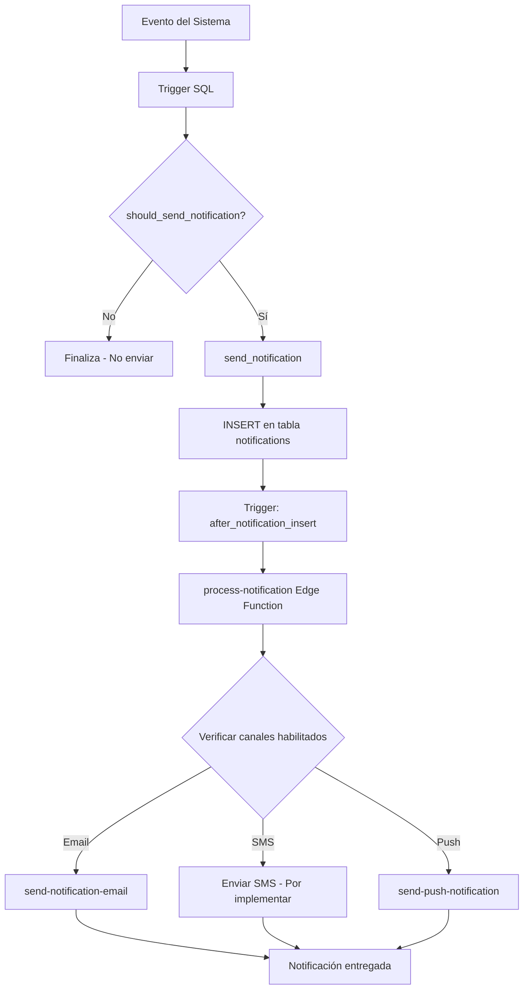

# Sistema de Notificaciones Multi-Canal

## Descripción General

El sistema de notificaciones ahora está completamente integrado con la configuración del panel de administración. Los administradores pueden controlar qué notificaciones se envían y por qué canales (Email, SMS, Push) directamente desde la UI.

## Arquitectura

### 1. Configuración en Admin Panel
- **Ubicación**: `/admin` → Configuración del Sistema → Tab Notificaciones
- Los administradores pueden:
  - Habilitar/deshabilitar tipos de notificaciones individuales
  - Seleccionar canales específicos (Email, SMS, Push) para cada tipo
  - Configurar email administrativo para recibir notificaciones

### 2. Base de Datos

#### Funciones SQL Clave

**`should_send_notification(notification_type, channel)`**
- Verifica si una notificación debe enviarse basándose en la configuración del admin
- Parámetros:
  - `notification_type`: ID del tipo de notificación (ej: 'new_user_registration')
  - `channel`: Canal a verificar ('email', 'sms', 'push', o 'all')
- Retorna: `boolean`

**`send_notification(p_user_id, p_type, p_title, p_message, p_action_url, p_data)`**
- Función unificada para crear notificaciones
- Verifica automáticamente si la notificación debe enviarse
- Inserta en la tabla `notifications` si está habilitada
- Retorna: `UUID` del notification_id o `NULL` si está deshabilitada

#### Triggers Actualizados

Los siguientes triggers ahora respetan la configuración del admin:
- `notify_new_applicant` - Nuevas aplicaciones
- `notify_service_inquiry_auto` - Consultas del marketplace
- `notify_opportunity_closed` - Oportunidades cerradas
- `notify_access_request_auto` - Solicitudes de acceso al equipo

### 3. Edge Function: `process-notification`

**Función**: Procesa notificaciones y las envía por múltiples canales
**Ubicación**: `supabase/functions/process-notification/index.ts`

**Flujo**:
1. Recibe `notification_id`
2. Consulta detalles de la notificación
3. Lee configuración de admin_settings
4. Envía por canales habilitados:
   - **Email**: Via `send-notification-email` function
   - **SMS**: Placeholder (por implementar con Twilio)
   - **Push**: Via `send-push-notification` function

**Invocación**:
```typescript
await supabase.functions.invoke('process-notification', {
  body: { notification_id: 'uuid-aqui' }
});
```

### 4. Frontend Library: `src/lib/notifications.ts`

#### Funciones Disponibles

**`sendNotification(params)`**
```typescript
await sendNotification({
  userId: 'user-uuid',
  type: 'application',
  title: '🎯 Nuevo aplicante',
  message: 'Juan Pérez aplicó a "Desarrollador Frontend"',
  actionUrl: '/applications/123',
  data: { applicationId: '123' }
});
```

**`isNotificationEnabled(notificationType)`**
```typescript
const enabled = await isNotificationEnabled(NOTIFICATION_TYPES.NEW_USER);
```

**`isChannelEnabled(notificationType, channel)`**
```typescript
const emailEnabled = await isChannelEnabled(
  NOTIFICATION_TYPES.NEW_USER, 
  'email'
);
```

**`getNotificationConfig()`**
```typescript
const config = await getNotificationConfig();
// Retorna array de configuraciones de notificaciones
```

## Tipos de Notificaciones Configurables

| ID | Nombre | Descripción |
|----|--------|-------------|
| `new_user_registration` | Nuevos Registros de Usuario | Cuando se registra un nuevo usuario |
| `user_email_verification` | Verificación de Email | Cuando un usuario verifica su email |
| `user_profile_completion` | Perfil Completado | Cuando un usuario completa su perfil |
| `new_company_registration` | Nueva Empresa Registrada | Cuando se registra una nueva empresa |
| `company_upgrade_request` | Solicitud de Upgrade | Solicitudes de mejora de plan |
| `company_verification` | Verificación de Empresa | Verificación de empresa completada |
| `opportunity_reports` | Reportes de Oportunidades | Reportes de contenido en oportunidades |
| `marketplace_reports` | Reportes del Marketplace | Reportes en servicios del marketplace |
| `user_reports` | Reportes de Usuarios | Reportes de usuarios |
| `content_approval` | Aprobación de Contenido | Contenido pendiente de aprobar |
| `system_errors` | Errores del Sistema | Errores críticos del sistema |
| `performance_issues` | Problemas de Rendimiento | Problemas de rendimiento detectados |
| `security_alerts` | Alertas de Seguridad | Alertas de seguridad críticas |
| `backup_status` | Estado de Backups | Estado de backups automáticos |

## Canales de Notificación

### Email
- **Estado**: ✅ Funcional
- **Implementación**: Via `send-notification-email` edge function
- **Requiere**: Configuración de Resend API key

### SMS
- **Estado**: ⏳ Por implementar
- **Propuesta**: Integración con Twilio
- **Requiere**: API key de Twilio y configuración de números

### Push (Web)
- **Estado**: ✅ Funcional
- **Implementación**: Via `send-push-notification` edge function
- **Requiere**: Usuario debe haber dado permiso de notificaciones push

## Flujo Completo de una Notificación



## Configuración Inicial

### 1. Panel de Admin
1. Ir a `/admin`
2. Configuración del Sistema → Notificaciones
3. Configurar email del administrador
4. Habilitar/deshabilitar tipos de notificaciones
5. Seleccionar canales para cada tipo
6. Guardar configuración

### 2. Verificación
```sql
-- Ver configuración actual
SELECT * FROM admin_settings 
WHERE category = 'notifications';

-- Probar función de verificación
SELECT should_send_notification('new_user_registration', 'email');
```

### 3. Pruebas Manuales
```typescript
// Desde el código frontend
import { sendNotification, NOTIFICATION_TYPES } from '@/lib/notifications';

await sendNotification({
  userId: 'test-user-id',
  type: 'application',
  title: 'Prueba de Notificación',
  message: 'Esta es una notificación de prueba',
  actionUrl: '/test'
});
```

## Debugging

### Ver logs de la edge function
```bash
# En Supabase Dashboard
Project → Edge Functions → process-notification → Logs
```

### Verificar notificaciones en base de datos
```sql
-- Ver notificaciones recientes
SELECT * FROM notifications 
ORDER BY created_at DESC 
LIMIT 10;

-- Ver notificaciones por tipo
SELECT type, COUNT(*) as count 
FROM notifications 
GROUP BY type;
```

### Probar manualmente la edge function
```typescript
const { data, error } = await supabase.functions.invoke(
  'process-notification',
  {
    body: { 
      notification_id: 'uuid-de-notificacion-existente' 
    }
  }
);
console.log('Resultado:', data, error);
```

## Próximos Pasos

1. **Implementar SMS**: Integrar Twilio para envío de SMS
2. **Plantillas de Email**: Crear plantillas HTML más sofisticadas
3. **Preferencias de Usuario**: Permitir que usuarios configuren sus propias preferencias
4. **Resumen Diario/Semanal**: Implementar notificaciones agrupadas
5. **Notificaciones In-App**: Sistema de notificaciones dentro de la aplicación
6. **Analytics**: Tracking de tasas de apertura y clics

## Soporte

Para problemas o preguntas:
1. Revisar logs de edge functions en Supabase Dashboard
2. Verificar configuración en panel de admin
3. Consultar documentación de Resend/Twilio según el canal
