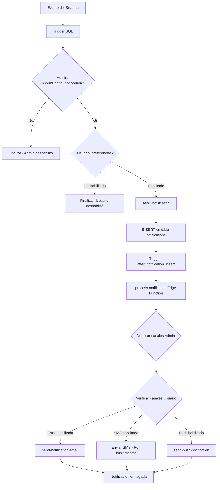

# Sistema de Notificaciones Multi-Canal

## Descripción General

El sistema de notificaciones ahora está completamente integrado con la configuración del panel de administración. Los administradores pueden controlar qué notificaciones se envían y por qué canales (Email, SMS, Push) directamente desde la UI.

## Arquitectura

### 1. Configuración en Admin Panel
- **Ubicación**: `/admin` → Configuración del Sistema → Tab Notificaciones
- Los administradores pueden:
  - Habilitar/deshabilitar tipos de notificaciones individuales
  - Seleccionar canales específicos (Email, SMS, Push) para cada tipo
  - Configurar email administrativo para recibir notificaciones

### 2. Configuración de Usuario (Talent y Business)
- **Talent**: `/talent-dashboard/settings` → Configuración de Talento → Tab Notificaciones
- **Business**: `/business-dashboard/settings` → Configuración Avanzada → Tab Notificaciones
- Los usuarios pueden:
  - Habilitar/deshabilitar tipos de notificaciones individuales para ellos
  - Seleccionar canales específicos (Email, SMS, Push) para cada tipo
  - Sus preferencias se respetan siempre que el admin haya habilitado el tipo

### 3. Base de Datos

#### Funciones SQL Clave

**`should_send_notification(notification_type, channel)`**
- Verifica si una notificación debe enviarse basándose en la configuración del admin
- Parámetros:
  - `notification_type`: ID del tipo de notificación (ej: 'new_user_registration')
  - `channel`: Canal a verificar ('email', 'sms', 'push', o 'all')
- Retorna: `boolean`

**`send_notification(p_user_id, p_type, p_title, p_message, p_action_url, p_data)`**
- Función unificada para crear notificaciones
- Verifica automáticamente:
  1. Si el admin ha habilitado la notificación
  2. Si el usuario ha habilitado la notificación en sus preferencias
- Inserta en la tabla `notifications` si está habilitada
- Retorna: `UUID` del notification_id o `NULL` si está deshabilitada

#### Tablas

**`admin_settings`**
- Almacena la configuración global de notificaciones del admin
- Category: 'notifications'
- Key: 'notifications' (JSON array) y 'admin_email' (string)

**`user_notification_preferences`**
- Almacena las preferencias individuales de cada usuario
- Columnas:
  - `user_id`: UUID del usuario
  - `notification_type`: Tipo de notificación
  - `enabled`: Si el usuario ha habilitado este tipo
  - `email`, `sms`, `push`: Canales habilitados
- Constraint único: (user_id, notification_type)

#### Triggers Actualizados

Los siguientes triggers ahora respetan la configuración del admin:
- `notify_new_applicant` - Nuevas aplicaciones
- `notify_service_inquiry_auto` - Consultas del marketplace
- `notify_opportunity_closed` - Oportunidades cerradas
- `notify_access_request_auto` - Solicitudes de acceso al equipo

### 3. Edge Function: `process-notification`

**Función**: Procesa notificaciones y las envía por múltiples canales
**Ubicación**: `supabase/functions/process-notification/index.ts`

**Flujo**:
1. Recibe `notification_id`
2. Consulta detalles de la notificación
3. Lee configuración de admin_settings
4. Lee preferencias del usuario de user_notification_preferences
5. Envía por canales habilitados (respeta tanto admin como usuario):
   - **Email**: Via `send-notification-email` function
   - **SMS**: Placeholder (por implementar con Twilio)
   - **Push**: Via `send-push-notification` function

**Invocación**:
```typescript
await supabase.functions.invoke('process-notification', {
  body: { notification_id: 'uuid-aqui' }
});
```

### 4. Frontend Library: `src/lib/notifications.ts`

#### Funciones Disponibles

**`sendNotification(params)`**
```typescript
await sendNotification({
  userId: 'user-uuid',
  type: 'application',
  title: '🎯 Nuevo aplicante',
  message: 'Juan Pérez aplicó a "Desarrollador Frontend"',
  actionUrl: '/applications/123',
  data: { applicationId: '123' }
});
```

**`isNotificationEnabled(notificationType)`**
```typescript
const enabled = await isNotificationEnabled(NOTIFICATION_TYPES.NEW_USER);
```

**`isChannelEnabled(notificationType, channel)`**
```typescript
const emailEnabled = await isChannelEnabled(
  NOTIFICATION_TYPES.NEW_USER, 
  'email'
);
```

**`getNotificationConfig()`**
```typescript
const config = await getNotificationConfig();
// Retorna array de configuraciones de notificaciones
```

## Tipos de Notificaciones Configurables

| ID | Nombre | Descripción |
|----|--------|-------------|
| `new_user_registration` | Nuevos Registros de Usuario | Cuando se registra un nuevo usuario |
| `user_email_verification` | Verificación de Email | Cuando un usuario verifica su email |
| `user_profile_completion` | Perfil Completado | Cuando un usuario completa su perfil |
| `new_company_registration` | Nueva Empresa Registrada | Cuando se registra una nueva empresa |
| `company_upgrade_request` | Solicitud de Upgrade | Solicitudes de mejora de plan |
| `company_verification` | Verificación de Empresa | Verificación de empresa completada |
| `opportunity_reports` | Reportes de Oportunidades | Reportes de contenido en oportunidades |
| `marketplace_reports` | Reportes del Marketplace | Reportes en servicios del marketplace |
| `user_reports` | Reportes de Usuarios | Reportes de usuarios |
| `content_approval` | Aprobación de Contenido | Contenido pendiente de aprobar |
| `system_errors` | Errores del Sistema | Errores críticos del sistema |
| `performance_issues` | Problemas de Rendimiento | Problemas de rendimiento detectados |
| `security_alerts` | Alertas de Seguridad | Alertas de seguridad críticas |
| `backup_status` | Estado de Backups | Estado de backups automáticos |

## Canales de Notificación

### Email
- **Estado**: ✅ Funcional
- **Implementación**: Via `send-notification-email` edge function
- **Requiere**: Configuración de Resend API key

### SMS
- **Estado**: ⏳ Por implementar
- **Propuesta**: Integración con Twilio
- **Requiere**: API key de Twilio y configuración de números

### Push (Web)
- **Estado**: ✅ Funcional
- **Implementación**: Via `send-push-notification` edge function
- **Requiere**: Usuario debe haber dado permiso de notificaciones push

## Flujo Completo de una Notificación


```mermaid
graph TD
    A[Evento del Sistema] --> B[Trigger SQL]
    B --> C{Admin: should_send_notification?}
    C -->|No| D[Finaliza - Admin deshabilitó]
    C -->|Sí| E{Usuario: preferencias?}
    E -->|Deshabilitado| F[Finaliza - Usuario deshabilitó]
    E -->|Habilitado| G[send_notification]
    G --> H[INSERT en tabla notifications]
    H --> I[Trigger: after_notification_insert]
    I --> J[process-notification Edge Function]
    J --> K{Verificar canales Admin}
    K --> L{Verificar canales Usuario}
    L -->|Email habilitado| M[send-notification-email]
    L -->|SMS habilitado| N[Enviar SMS - Por implementar]
    L -->|Push habilitado| O[send-push-notification]
    M --> P[Notificación entregada]
    N --> P
    O --> P
```

## Configuración Inicial

### 1. Panel de Admin
1. Ir a `/admin`
2. Configuración del Sistema → Notificaciones
3. Configurar email del administrador
4. Habilitar/deshabilitar tipos de notificaciones
5. Seleccionar canales para cada tipo
6. Guardar configuración

### 2. Configuración de Usuarios
1. **Talent**: Ir a `/talent-dashboard/settings` → Notificaciones
2. **Business**: Ir a `/business-dashboard/settings` → Tab Notificaciones
3. Personalizar preferencias individuales
4. Seleccionar canales deseados
5. Guardar preferencias

### 3. Verificación
```sql
-- Ver configuración actual
SELECT * FROM admin_settings 
WHERE category = 'notifications';

-- Ver preferencias de usuarios
SELECT * FROM user_notification_preferences
WHERE user_id = 'user-id-here';

-- Probar función de verificación
SELECT should_send_notification('new_user_registration', 'email');
```

### 3. Pruebas Manuales
```typescript
// Desde el código frontend
import { sendNotification, NOTIFICATION_TYPES } from '@/lib/notifications';

await sendNotification({
  userId: 'test-user-id',
  type: 'application',
  title: 'Prueba de Notificación',
  message: 'Esta es una notificación de prueba',
  actionUrl: '/test'
});
```

## Debugging

### Ver logs de la edge function
```bash
# En Supabase Dashboard
Project → Edge Functions → process-notification → Logs
```

### Verificar notificaciones en base de datos
```sql
-- Ver notificaciones recientes
SELECT * FROM notifications 
ORDER BY created_at DESC 
LIMIT 10;

-- Ver notificaciones por tipo
SELECT type, COUNT(*) as count 
FROM notifications 
GROUP BY type;

-- Ver preferencias de un usuario
SELECT 
  unp.*,
  CASE 
    WHEN unp.enabled THEN 'Habilitado'
    ELSE 'Deshabilitado'
  END as status
FROM user_notification_preferences unp
WHERE user_id = 'user-id-here';
```

### Probar manualmente la edge function
```typescript
const { data, error } = await supabase.functions.invoke(
  'process-notification',
  {
    body: { 
      notification_id: 'uuid-de-notificacion-existente' 
    }
  }
);
console.log('Resultado:', data, error);
```

## Próximos Pasos

1. **Implementar SMS**: Integrar Twilio para envío de SMS
2. **Plantillas de Email**: Crear plantillas HTML más sofisticadas
3. **Horarios de Silencio**: Implementar quiet hours para no molestar
4. **Resumen Diario/Semanal**: Implementar notificaciones agrupadas
5. **Notificaciones In-App**: Sistema de notificaciones dentro de la aplicación
6. **Analytics**: Tracking de tasas de apertura y clics
7. **Testing A/B**: Probar diferentes mensajes y canales

## Jerarquía de Configuración

**Prioridad de configuración (de mayor a menor):**
1. **Admin deshabilitado** → No se envía, sin importar preferencias del usuario
2. **Usuario deshabilitado** → No se envía para ese usuario específico
3. **Canal deshabilitado por Admin** → No se envía por ese canal, sin importar usuario
4. **Canal deshabilitado por Usuario** → No se envía por ese canal para ese usuario

**Ejemplo:**
- Admin habilita "Nuevas Aplicaciones" con Email y Push
- Usuario A deshabilita Push para "Nuevas Aplicaciones"
- Resultado: Usuario A solo recibe por Email

- Admin deshabilita "Nuevas Aplicaciones" completamente
- Usuario A tiene todo habilitado
- Resultado: Nadie recibe notificaciones de ese tipo

## Soporte

Para problemas o preguntas:
1. Revisar logs de edge functions en Supabase Dashboard
2. Verificar configuración en panel de admin
3. Consultar documentación de Resend/Twilio según el canal
