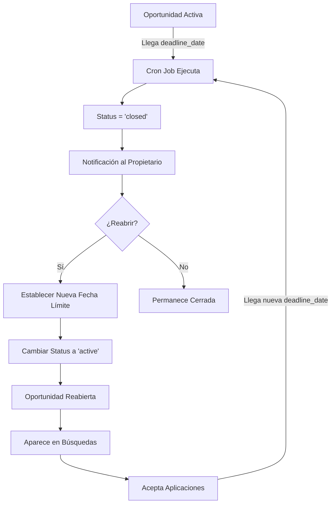

# Cómo Reabrir Oportunidades Cerradas

## Comportamiento del Sistema

### Cierre Automático
Las oportunidades se cierran automáticamente cuando:
- Se alcanza la fecha límite (`deadline_date`)
- El sistema ejecuta el cron job `close-expired-opportunities` diariamente a las 00:05 AM UTC
- El status cambia a 'closed' y `is_active` se establece en false

### Fecha Límite Obligatoria
Todas las oportunidades **deben** tener una fecha límite para evitar publicaciones "fantasmas" u olvidadas. Esto asegura que:
- Las oportunidades tengan un plazo definido de aplicación
- Se evite la acumulación de oportunidades inactivas
- Los talentos sepan el tiempo disponible para aplicar

### Notificación de Cierre
Cuando una oportunidad se cierra automáticamente:
- El propietario de la empresa recibe una notificación
- La notificación incluye un enlace directo a la oportunidad
- Se informa que la oportunidad puede reabrirse

## Cómo Reabrir una Oportunidad

### Desde el Dashboard de Oportunidades

1. **Acceder a la oportunidad cerrada**
   - Ir a `/business-dashboard/opportunities`
   - Las oportunidades cerradas aparecen con un badge "Cerrada"
   - Click en la oportunidad para ver los detalles

2. **Editar la oportunidad**
   - Click en el botón "Editar" o el ícono de edición
   - Esto abre el formulario de edición

3. **Actualizar la fecha límite**
   - Cambiar la fecha límite a una fecha futura
   - La fecha debe ser posterior a hoy
   - Máximo 6 meses en adelante

4. **Cambiar el status**
   - Cambiar el status de 'closed' a 'active'
   - Esto se puede hacer desde:
     - El formulario de edición
     - El botón de toggle en la lista de oportunidades
     - El panel de detalles de la oportunidad

5. **Guardar cambios**
   - Click en "Guardar" o "Actualizar"
   - La oportunidad volverá a aparecer en las búsquedas
   - Los talentos podrán aplicar nuevamente

### Consideraciones Importantes

**Al Reabrir una Oportunidad:**
- ✅ Vuelve a aparecer en las búsquedas de talentos
- ✅ Acepta nuevas aplicaciones
- ✅ Se mantienen las aplicaciones anteriores
- ✅ Se preservan todos los datos históricos
- ✅ Se puede volver a cerrar manualmente o automáticamente al llegar a la nueva fecha límite

**Restricciones:**
- ⚠️ Debe establecer una nueva fecha límite válida
- ⚠️ No se pueden reabrir oportunidades sin establecer una fecha límite futura
- ⚠️ Los talentos no pueden aplicar a oportunidades cerradas hasta que se reabran

## Implementación Técnica

### Actualización Mediante UI

```typescript
// En el componente de edición de oportunidades
const handleReopen = async (opportunityId: string, newDeadline: Date) => {
  const { error } = await supabase
    .from('opportunities')
    .update({
      status: 'active',
      is_active: true,
      deadline_date: newDeadline.toISOString().split('T')[0],
      updated_at: new Date().toISOString()
    })
    .eq('id', opportunityId);

  if (error) {
    toast.error('Error al reabrir la oportunidad');
    return;
  }

  toast.success('Oportunidad reabierta exitosamente');
};
```

### Actualización Directa en Base de Datos

```sql
-- Reabrir una oportunidad específica
UPDATE opportunities
SET 
  status = 'active',
  is_active = true,
  deadline_date = '2025-12-31', -- Nueva fecha límite
  updated_at = now()
WHERE id = 'opportunity-uuid-here'
  AND status = 'closed';
```

### Verificar Estado de Oportunidad

```sql
-- Ver oportunidades cerradas de una empresa
SELECT 
  id,
  title,
  status,
  deadline_date,
  created_at,
  updated_at
FROM opportunities
WHERE company_id = 'company-uuid-here'
  AND status = 'closed'
ORDER BY updated_at DESC;
```

## Workflow Completo



## Mensajes al Usuario

### Notificación de Cierre
```
📅 Oportunidad cerrada por fecha límite

Tu oportunidad "[Título]" se ha cerrado automáticamente al 
alcanzar su fecha límite. Puedes reabrirla y establecer una 
nueva fecha desde tu dashboard.

[Ver Oportunidad]
```

### Confirmación de Reapertura
```
✅ Oportunidad reabierta exitosamente

"[Título]" está nuevamente activa y aparecerá en las búsquedas. 
Los talentos pueden aplicar hasta: [Nueva Fecha Límite]
```

### Advertencia al Intentar Aplicar a Oportunidad Cerrada
```
⚠️ Oportunidad no disponible

Esta oportunidad ha sido cerrada y ya no acepta aplicaciones.

Fecha límite: [Fecha]
```

## Beneficios del Sistema

1. **Previene Publicaciones Fantasma**: Todas las oportunidades tienen una fecha de expiración
2. **Mantiene Contenido Fresco**: Solo se muestran oportunidades con fechas límite válidas
3. **Control Total**: Las empresas pueden reabrir cuando lo necesiten
4. **Transparencia**: Los talentos saben exactamente cuándo expira una oportunidad
5. **Automatización**: El sistema cierra oportunidades sin intervención manual
6. **Flexibilidad**: Se pueden establecer nuevas fechas límite al reabrir

## Preguntas Frecuentes

**P: ¿Qué pasa con las aplicaciones cuando se cierra una oportunidad?**
R: Las aplicaciones se mantienen intactas. Puedes revisarlas en cualquier momento y seguirán ahí cuando reabras la oportunidad.

**P: ¿Puedo reabrir una oportunidad varias veces?**
R: Sí, puedes reabrir una oportunidad tantas veces como necesites, siempre estableciendo una nueva fecha límite futura.

**P: ¿Los talentos verán oportunidades cerradas en sus búsquedas?**
R: No, las oportunidades cerradas se filtran automáticamente de todas las búsquedas y listados.

**P: ¿Puedo cerrar una oportunidad manualmente antes de la fecha límite?**
R: Sí, puedes cambiar el status a 'closed' en cualquier momento desde el dashboard.

**P: ¿Cuál es la duración máxima de la fecha límite?**
R: La fecha límite puede ser máximo 6 meses en el futuro desde la fecha actual.
